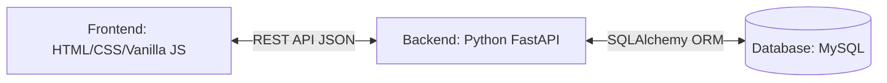

# 🤖 SKILL FILE — FinTrack Expense Tracker (Portfolio Edition)
> Panduan wajib untuk AI Agent agar efisien & tidak melenceng.
> BACA INI SEBELUM MELAKUKAN APAPUN.

---

## ⚡ PROTOKOL EFISIENSI AGENT

### 1. URUTAN KERJA WAJIB
1. Baca `PROGRESS.md` → cek langkah terakhir yang selesai
2. Lanjutkan dari langkah berikutnya (jangan mengulang yang sudah ✅)
3. Setelah selesai satu langkah → UPDATE `PROGRESS.md` (ubah ⏳ → ✅)
4. Jangan baca file proyek lain kecuali memang perlu

### 2. HEMAT TOKEN
- JANGAN baca ulang `Submission.md` — semua info sudah ada di `PROGRESS.md`
- JANGAN list direktori jika sudah tahu struktur dari `PROGRESS.md`
- Buat/edit file langsung tanpa bertanya jika sudah jelas dari PROGRESS.md
- Cek `PROGRESS.md` dulu → baru kerja

### 3. ANTI-HALUSINASI
- Semua `data-testid` yang wajib ada di section "ATURAN WAJIB" di `PROGRESS.md`
- Jangan mengarang id atau class HTML baru untuk element yang sudah ada
- Semua nama variabel JS harus konsisten dengan yang ada di file yang sudah dibuat

---

## 🏗️ ARSITEKTUR APLIKASI

### File Responsibilities:
| File | Isi | Boleh Diubah? |
|------|-----|---------------|
| `index.html` | Struktur DOM, semua id dan data-testid wajib | Hanya tambah, jangan hapus elemen existing |
| `style.css` | Semua styling, animasi, responsive | Bebas sepenuhnya |
| `main.js` | Semua logika JS, event listener | Bebas sepenuhnya |

### State Management Pattern:
```js
// SATU source of truth — array global
let transactions = JSON.parse(localStorage.getItem('fintrack_transactions')) || [];
let editId = null;         // null = mode tambah, number = mode edit
let searchQuery = '';      // query pencarian aktif

// === PHASE 2 STATE (portfolio features) ===
let filterMonth = '';      // format: 'YYYY-MM', kosong = semua bulan
let sortBy = 'date-desc';  // 'date-desc'|'date-asc'|'amount-desc'|'amount-asc'
let filterCategory = '';   // kosong = semua kategori
let budgetLimit = 0;       // 0 = tidak ada limit

// Selalu simpan ke localStorage setelah perubahan
function saveToStorage() {
  localStorage.setItem('fintrack_transactions', JSON.stringify(transactions));
}
```

### Render Pattern (WAJIB — bukan innerHTML+=):
```js
function renderTransaction(tx) {
  const div = document.createElement('div');
  div.setAttribute('data-testid', 'transactionItem');
  div.dataset.id = tx.id;
  
  const h3 = document.createElement('h3');
  h3.setAttribute('data-testid', 'transactionItemTitle');
  h3.textContent = tx.title;
  div.appendChild(h3);
  // ... dst
  return div;
}
```

### Custom Event Pattern (untuk Advanced score):
```js
// Dispatch event setelah data berubah
document.dispatchEvent(new CustomEvent('transactionUpdated', {
  detail: { transactions, searchQuery }
}));

// Listen event untuk update UI
document.addEventListener('transactionUpdated', (e) => {
  renderAllTransactions(e.detail.transactions, e.detail.searchQuery);
  updateSummary(e.detail.transactions);
});
```

---

## 📦 KATEGORI TRANSAKSI (Fase 2 Feature)

### Daftar Kategori:
```js
const CATEGORIES = {
  income: ['Gaji', 'Freelance', 'Investasi', 'Bisnis', 'Bonus', 'Lainnya'],
  expense: ['Makanan', 'Transport', 'Belanja', 'Tagihan', 'Hiburan', 'Kesehatan', 'Pendidikan', 'Lainnya']
};
```

### Icon Kategori (Material Symbols):
```js
const CATEGORY_ICONS = {
  'Gaji': 'payments',
  'Freelance': 'computer',
  'Investasi': 'trending_up',
  'Bisnis': 'store',
  'Bonus': 'card_giftcard',
  'Makanan': 'restaurant',
  'Transport': 'directions_car',
  'Belanja': 'shopping_bag',
  'Tagihan': 'receipt',
  'Hiburan': 'movie',
  'Kesehatan': 'health_and_safety',
  'Pendidikan': 'school',
  'Lainnya': 'more_horiz'
};
```

---

## 📊 GRAFIK CHART (Fase 2 — Canvas API)

### Pendekatan (NO external library):
```js
// Gunakan native Canvas API
const canvas = document.getElementById('spendingChart');
const ctx = canvas.getContext('2d');

// Bar chart sederhana
function drawBarChart(data) {
  ctx.clearRect(0, 0, canvas.width, canvas.height);
  // ... draw bars manually
}

// Donut chart untuk proporsi income/expense
function drawDonutChart(income, expense) {
  const total = income + expense;
  const incomeAngle = (income / total) * Math.PI * 2;
  // ctx.arc(...)
}
```

### Data untuk chart:
```js
// Data 6 bulan terakhir untuk bar chart
function getLast6MonthsData() {
  const months = [];
  for (let i = 5; i >= 0; i--) {
    const d = new Date();
    d.setMonth(d.getMonth() - i);
    const key = `${d.getFullYear()}-${String(d.getMonth() + 1).padStart(2, '0')}`;
    months.push({
      label: d.toLocaleDateString('id-ID', { month: 'short' }),
      income: transactions.filter(t => t.type === 'income' && t.date.startsWith(key)).reduce((s,t) => s+t.amount, 0),
      expense: transactions.filter(t => t.type === 'expense' && t.date.startsWith(key)).reduce((s,t) => s+t.amount, 0),
    });
  }
  return months;
}
```

---

## 🎨 DESIGN SYSTEM (lihat DESIGN.md untuk detail lengkap)

### Palet Warna Utama:
```css
--color-bg: #F7F8FA;
--color-surface: #FFFFFF;
--color-border: #E5E7EB;
--color-primary: #2563EB;
--color-income: #059669;
--color-expense: #DC2626;
--color-text: #111827;
--color-text-muted: #6B7280;
```

### Font:
```css
@import url('https://fonts.googleapis.com/css2?family=Plus+Jakarta+Sans:wght@400;500;600;700&display=swap');
font-family: 'Plus Jakarta Sans', system-ui, sans-serif;
```

### Dark Mode Extension (Fase 2):
```css
[data-theme="dark"] {
  --color-bg: #0F172A;
  --color-surface: #1E293B;
  --color-border: rgba(255,255,255,0.08);
  --color-text: #F1F5F9;
  --color-text-muted: #94A3B8;
}
```

---

## 🔒 ELEMEN HTML WAJIB (dari Submission — JANGAN DIHAPUS/DIUBAH)

ID wajib yang digunakan JS:
```
#incomeList        → container kartu pemasukan
#expenseList       → container kartu pengeluaran
#balance           → saldo
#totalIncome       → total pemasukan
#totalExpense      → total pengeluaran
#transactionForm   → form transaksi
#searchInput       → input pencarian
#greeting          → teks greeting
```

data-testid wajib pada SETIAP kartu transaksi:
```
data-testid="transactionItem"
data-testid="transactionItemTitle"
data-testid="transactionItemAmount"      → format: "Nominal: Rp10000"
data-testid="transactionItemDate"        → format: "Tanggal: 2026-06-07"
data-testid="transactionItemType"        → format: "Tipe: Pemasukan" / "Tipe: Pengeluaran"
data-testid="transactionItemEditTypeButton"  → teks/aria: "Ubah Tipe"
data-testid="transactionItemDeleteButton"    → teks/aria: "Hapus"
```

---

## ✅ LOGIC FLOW (Existing — JANGAN DIUBAH)

### Tambah Transaksi:
1. Ambil nilai form → validasi (kosong → showToast error)
2. Buat objek transaksi `{ id: +new Date(), title, amount: +amount, date, type }`
3. Push ke array `transactions`
4. `saveToStorage()`
5. `dispatchTransactionUpdated()` → event listener render ulang + update saldo
6. Reset form

### Edit Transaksi:
1. Klik tombol Edit → set `editId = tx.id`
2. Isi form dengan data dari `transactions.find(t => t.id === editId)`
3. Ganti teks tombol submit → "Simpan Perubahan"
4. Submit form → update objek di array (jangan push baru)
5. `saveToStorage()` → dispatch event → render ulang → reset form + `editId = null`

### Hapus Transaksi:
1. Klik tombol Hapus → `transactions = transactions.filter(t => t.id !== id)`
2. `saveToStorage()` → dispatch event → render ulang

### Ubah Tipe:
1. Klik "Ubah Tipe" → temukan transaksi di array
2. Toggle: `'income' → 'expense'` atau `'expense' → 'income'`
3. `saveToStorage()` → dispatch event → render ulang

### Pencarian:
1. Listen event `input` pada search field
2. Filter `transactions` berdasarkan `title.toLowerCase().includes(query)`
3. Render hasil filter (JANGAN ubah array `transactions`, hanya filter tampilan)
4. Jika query kosong → render semua `transactions`

---

## 🆕 LOGIC FLOW — FASE 2 (Portfolio Features)

### Filter Bulan/Tahun (P3):
```js
function getFilteredTransactions() {
  let result = [...transactions];
  if (filterMonth) result = result.filter(t => t.date.startsWith(filterMonth));
  if (filterCategory) result = result.filter(t => t.category === filterCategory);
  if (searchQuery) result = result.filter(t => t.title.toLowerCase().includes(searchQuery.toLowerCase()));
  // sorting
  result.sort((a, b) => {
    if (sortBy === 'date-desc') return b.date.localeCompare(a.date);
    if (sortBy === 'date-asc') return a.date.localeCompare(b.date);
    if (sortBy === 'amount-desc') return b.amount - a.amount;
    if (sortBy === 'amount-asc') return a.amount - b.amount;
    return 0;
  });
  return result;
}
```

### Export CSV (P5):
```js
function exportCSV() {
  const header = 'ID,Judul,Jumlah,Tanggal,Tipe,Kategori\n';
  const rows = transactions.map(t =>
    `${t.id},"${t.title}",${t.amount},${t.date},${t.type},${t.category || '-'}`
  ).join('\n');
  const blob = new Blob([header + rows], { type: 'text/csv' });
  const url = URL.createObjectURL(blob);
  const a = document.createElement('a');
  a.href = url; a.download = 'fintrack-export.csv'; a.click();
  URL.revokeObjectURL(url);
}
```

### Budget Limit (P6):
```js
// Simpan limit ke localStorage
const BUDGET_KEY = 'fintrack_budget';
function checkBudget() {
  const budget = +localStorage.getItem(BUDGET_KEY) || 0;
  if (!budget) return;
  const currentMonth = new Date().toISOString().slice(0, 7);
  const spent = transactions
    .filter(t => t.type === 'expense' && t.date.startsWith(currentMonth))
    .reduce((s, t) => s + t.amount, 0);
  const pct = (spent / budget) * 100;
  if (pct >= 100) showToast('⚠️ Budget bulan ini sudah habis!', 'error', 5000);
  else if (pct >= 80) showToast(`⚠️ Budget tersisa ${(100-pct).toFixed(0)}%`, 'warning', 4000);
}
```

---

## 🚫 LARANGAN KERAS

1. `innerHTML +=` untuk menambah kartu → REJECT otomatis
2. Mengubah nilai `data-testid`
3. Mengubah nilai `id` elemen yang direferensikan JS (incomeList, expenseList, dll)
4. Menghapus elemen HTML yang ada di starter
5. Menyimpan `amount` sebagai string di localStorage
6. Menggunakan library eksternal (Chart.js, jQuery, dll) — gunakan native Web API saja

---

## 💡 TIPS PORTFOLIO PRESENTATION

- Tambahkan screenshot/demo GIF di README.md
- Jelaskan arsitektur Custom Event di README
- Sertakan link live demo (Netlify/Vercel/GitHub Pages)
- Tulis komentar kode yang bersih dan profesional
- Pastikan Lighthouse score ≥ 90 (Performance + Accessibility)
- Zero console errors saat production

---

## 🐍 6. EVOLUSI ARSITEKTUR: FASE 3 (FULL-STACK PYTHON)

*(Dokumentasi arsitektur masa depan untuk transisi dari LocalStorage ke REST API)*

### Arsitektur Sistem Jaringan


### Strategi Refactoring Frontend
Pada Fase 3, `main.js` akan melepaskan ketergantungan pada `localStorage`.
Semua operasi I/O data akan digantikan dengan native `fetch()` API.

**Contoh Transisi (Pengambilan Data):**
```javascript
// [SEBELUMNYA - LOKAL]
// transactions = JSON.parse(localStorage.getItem('fintrack_transactions'));

// [MASA DEPAN - CLOUD]
async function fetchTransactions() {
  const response = await fetch('http://localhost:8000/api/transactions', {
    headers: { 'Authorization': `Bearer ${authToken}` }
  });
  if (response.status === 401) {
     handleUnauthorized(); // Token kadaluarsa/tidak valid
     return;
  }
  transactions = await response.json();
  dispatchTransactionUpdated();
}
```

### 🔒 Strategi Autentikasi Frontend (JWT)
1. **Penyimpanan Token**: Token JWT disimpan di `localStorage` dengan key `fintrack_token`.
2. **Global State**: Variabel `authToken` memuat token di memori.
3. **Pencegatan UI**: Saat `authToken` bernilai `null`, elemen `<main class="app-main">` diubah menjadi `display: none;` dan Modal Login dimunculkan.
4. **Header Request**: Setiap I/O data (GET, POST, PUT, DELETE) wajib menyertakan:
   ```javascript
   headers: { 'Authorization': `Bearer ${authToken}` }
   ```

### Standar Teknis Backend (Terimplementasi)
1. **Framework**: `FastAPI` (Python)
2. **Server**: `Uvicorn`
3. **Database ORM**: `SQLAlchemy`
4. **Validasi**: `Pydantic` Models
5. **Autentikasi**: JWT (JSON Web Tokens) Bearer + Bcrypt Password Hashing
6. **CORS Policy**: Mengizinkan origin Frontend (`http://localhost:5500`, `http://localhost:8899`).

---
_File ini adalah panduan tetap. Update hanya jika ada perubahan arsitektur besar._
